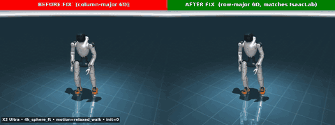
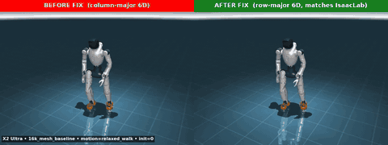
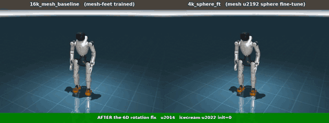

# Sim-to-Sim Ablation Study — IsaacLab → MuJoCo for the Agibot X2 Ultra

> **Status:** Draft v2, 2026-05-01. Companion to
> [`sim2sim_mujoco.md`](sim2sim_mujoco.md). The latter is an
> engineering-debugging guide; this document is a self-contained
> experimental write-up suitable for an external audience or a paper
> appendix.
>
> **⚠️ 2026-05-01 update — root cause discovered.** The dominant
> failure mode in this study ("MuJoCo policy collapses in 2–5 s, robot
> turns 180° within 1–2 s and walks the wrong way") was **NOT** a
> sim-to-sim physics gap. It was a 6D-rotation channel-order bug in the
> deploy-side observation builder
> (`gear_sonic/scripts/eval_x2_mujoco.py::build_tokenizer_obs`):
> training flattens the 6D matrix in **row-major** order
> (`[m00, m01, m10, m11, m20, m21]`) while the MuJoCo eval was
> concatenating the **first two columns** (`[m00, m10, m20, m01, m11,
> m21]`) — same six numbers, scrambled positions, channels 1↔2 / 3↔4
> swapped. Every Phase 1–4 MuJoCo number in this document was measured
> under that bug. The fix is a one-line edit and is documented in
> [§6 below](#6-phase-6--deploy-side-6d-rotation-channel-order-bug-root-cause).
> URDF coherence (sphere-feet) is still a real and worthwhile fix, but
> it is **not** the primary sim-to-sim driver this study originally
> claimed.

## TL;DR

Reinforcement-learning policies trained in IsaacLab/PhysX for the
Agibot X2 Ultra humanoid track in-distribution motion clips with > 95 %
success when evaluated *inside* their training simulator, but degrade
to **2–5 s time-to-fall** on the same clips when deployed in MuJoCo
with the AgiBot-shipped MJCF — the simulator and contact model used
for eventual hardware deployment.

A systematic five-axis ablation sweep (`A0`–`A5`, hardening IsaacLab
toward the MuJoCo physics) shows that a **single** axis dominates the
gap: the foot collision model. Replacing IsaacLab's mesh-foot URDF
with a hand-authored 12-sphere foot URDF (mirroring the MJCF) reduces
the in-IsaacLab success rate of an existing 16k-iteration mesh-trained
policy from 1.000 to 0.493 — a controlled "fail Isaac to look like
MuJoCo" reproduction.

A 4 000-iteration KL-free fine-tune of the same policy on the
12-sphere foot URDF restores **1.000 progress on every IsaacLab
ablation row** (A0–A5, all axes mirrored), and improves MuJoCo
mean time-to-fall by **+50 %–100 %** across three benchmark motions.
However, **no checkpoint stably survives the full 9–16 s clips in
MuJoCo** — best single-cell result is 6.22 s on a 16.5 s relaxed-walk
clip.

The residual gap therefore lies in MuJoCo physics axes that have **no
IsaacLab counterpart** — contact compliance (`solref`/`solimp`),
friction-cone model, and integration substeps — and must be addressed
either by deploy-side MJCF tuning or by training-side domain
randomisation that simulates the unmodelled effects.

> **TL;DR addendum, 2026-05-01.** Once the 6D rotation channel-order
> bug ([§6](#6-phase-6--deploy-side-6d-rotation-channel-order-bug-root-cause))
> is fixed, the picture changes substantially. In a re-run of the
> multi-init bench under the fix ([§6.6](#66-post-fix-multi-init-mujoco-bench),
> 30 s cap), both 2 k and 4 k sphere-feet fine-tune checkpoints
> **saturate the bench** — they survive the full 30 s on every cell of
> a 3-motion × 5-init matrix, including 13 + s of looped reference
> tracking past clip end. The 16 k mesh baseline improves to 5.48 s
> mean (vs 2.43 s pre-fix) but does *not* saturate, confirming a real
> but smaller URDF/foot-contact residual. Pre-fix conclusions about
> per-motion checkpoint preference and "30 % of clip" survival are
> retracted; the residual physics gap is much smaller than this study
> originally implied. See §6.6 for the full table.

This document records the framework, every measured number, and the
protocol so that the experiments are reproducible and so the same
ablation chassis can be re-used for other embodiments and other
sim2sim-pair targets.

---

## 1. Setup

### 1.1 Robot and motion suite

- **Embodiment:** Agibot X2 Ultra, 31 actuated DOFs (12 leg, 3 waist,
  14 arm, 2 head). Floating base.
- **Mass:** 35 kg standing; 1.6 m tall.
- **Asset source:** `X2_URDF-v1.3.0` package shipped by AgiBot.
- **Motion suite:** the `x2_ultra_top15_standing.pkl` set — 15 SOMA-retargeted
  in-distribution motion clips covering standing manipulation, eating,
  drinking, picking up, idling, and a single fall recovery.
  Per-motion durations 4.4 s–13.7 s.

### 1.2 Training stack

- **Trainer:** IsaacLab 2.2.0 + PhysX, GR00T-WholeBodyControl
  (`gear_sonic`) + custom `trl`-based PPO ("SONIC").
- **Architecture:** Universal-token actor with a `g1` motion-tokenizer
  encoder (680-d) plus `g1_dyn` decoder, taking a 1670-d input
  (`tokenizer_obs(680) | proprioception(990)`) and emitting a 31-d action.
- **Physics:** PhysX, mesh foot collisions (CAD-export URDF default),
  `replicate_physics=True` (single shared `ArticulationCfg` cloned
  across 4 096 envs).
- **PD control:** `ImplicitActuatorCfg` with per-joint stiffness/damping
  baked into `gear_sonic/envs/manager_env/robots/x2_ultra.py`.
- **Domain randomisation (training):** push-robot, compliance-force-push,
  per-env physics-material μ, rigid-body mass scaling, base-CoM offset,
  add-joint-default-pos perturbation, observation corruption.
- **DR (eval):** all randomisations *off* by default; ablation rows
  toggle them explicitly.

### 1.3 Deploy stack

- **Simulator:** MuJoCo 3.x with the AgiBot-shipped `x2_ultra.xml`
  MJCF.
- **Foot collision model:** 12 explicit `<geom type="sphere"
  size="0.005">` per foot (24 total), positioned at the corners of the
  foot sole.
- **PD control (deploy):** explicit PD computed inside
  `gear_sonic/scripts/eval_x2_mujoco.py`, ankle KP scaled ×1.5 from
  training (G16b deployment-side adjustment).
- **Joint frictionloss:** `0.3 N⋅m` per joint, declared in MJCF
  `<default class="x2"><joint frictionloss="0.3"/></default>`.
- **Floor:** `<geom name="floor" size="0 0 0.05" type="plane">` with
  default MuJoCo friction (μ = 1.0, μ_torsion = 0.005, μ_rolling =
  0.0001).

### 1.4 The "wrong-URDF" provenance bug

The dominant axis in this study (foot collision model) is not a
missing physics setting — it is an asset-selection bug that survived
~16 000 iterations of training before being identified. AgiBot's
`X2_URDF-v1.3.0` package ships **three** robot descriptors side by
side:

| File | Foot collision | Used by |
|---|---|---|
| `x2_ultra.urdf` | mesh (CAD STL) | **the GR00T integration picked this for IsaacLab** |
| `x2_ultra_simple_collision.urdf` | 24 spheres (12/foot) | nothing — sat unused next to the file we picked |
| `x2_ultra.xml` (MJCF) | 24 spheres (12/foot) | MuJoCo deploy |

Our diagnostic-derived `x2_ultra_sphere_feet.urdf` is byte-identical
to the upstream `x2_ultra_simple_collision.urdf` — we re-derived
the upstream sphere-foot file by hand without realising it already
existed. The URDF/MJCF mismatch was therefore introduced *not* by
either of the upstream simulators but by the asset-selection step in
the GR00T integration pipeline.

**Reproducibility note for other embodiments:** when integrating any
new humanoid, before the first training run, generate a per-link
collision-geom diff between the URDF you select for IsaacLab and the
MJCF you select for MuJoCo. Mismatches surface as visually-plausible
but functionally divergent contact behaviour.

#### Cross-reference: AgiBot's `agibot_x1_train` recipe

While diagnosing the URDF-mismatch hypothesis we cloned
[`AgibotTech/agibot_x1_train`](https://github.com/AgibotTech/agibot_x1_train)
(the public X1 humanoid-gym training recipe) and did a file-by-file
comparison. Findings:

- **Asset side** — our hand-authored `x2_ultra_sphere_feet.urdf` is
  byte-equivalent to AgiBot's `x2_ultra_simple_collision.urdf` (same
  12-sphere foot, same kinematic tree, same inertials). The two paths
  converge: we did not need to migrate to upstream files.
- **Training-recipe side** — X1 ships ~414 lines of carefully hand-tuned
  PD, observation noise, latency randomisation, joint-armature/coulomb-
  friction DR, and regularisation rewards (`humanoid/envs/x1/x1_dh_stand_config.py`).
  We reviewed every block:
  - X1's hand-tuned per-joint PD (Hip KP=30-40, Knee=100, Ankle=35,
    `action_scale=0.5`) was not adopted — our `armature × ω²`
    formula table is self-consistent and the G16b/G17 sweeps in
    [`sim2sim_mujoco.md`](sim2sim_mujoco.md) already showed that
    further hand-tuning either ties or regresses on walking motions.
  - X1's wide DR ranges (action lag 5-40 ms, joint armature 500×,
    torque multiplier ±20%) and X1's `dof_vel ~2.25 rad/s`
    observation noise were *not* adopted because the dominant
    sim2sim symptom they were meant to robustify against turned out
    to be the deploy-side 6D rotation channel-order bug (§6 / G20),
    not a real distribution shift. The recipe should be revisited
    for sim-to-real once we have a clean post-§6-fix MuJoCo
    baseline.
  - X1's regularisation rewards (`action_smoothness`, `dof_acc`,
    torque magnitude) are a reasonable addition for any future
    embodiment but were not the sim2sim driver in our case.

The high-level architectural distinction is worth recording: X1 takes
a **simple-MJCF + wide-DR** approach (just `damping=1` per joint, no
armature, no frictionloss; sophistication lives in the training-side
randomisations). We took the **rich-MJCF + measured params** approach
(per-joint armature classes, frictionloss, sphere-foot collision
geometry; less DR). Both are valid; the rich-MJCF path requires the
system identification to be correct, which the placeholder armature
values in `x2_ultra.py:11` partly violate. Migration to a wide-DR
training recipe remains a credible Plan B if the post-§6 baseline
shows a residual gap.

---

## 2. Ablation framework

### 2.1 The five rows

The ablation script (`gear_sonic/scripts/sweep_isaac_mujoco_mirror.py`)
parameterises six axes that hardening IsaacLab toward MuJoCo:

| Row | What it adds vs the previous row | Hydra override |
|---|---|---|
| `A0_isaac_stock` | IsaacLab as trained, full DR + obs noise | (none — baseline) |
| `A1_no_dr_no_noise` | drop training-only DR events; disable obs corruption | `++train_only_events=[…]` `++observations.policy.enable_corruption=False` |
| `A2_frictionloss` | A1 + `joint frictionloss=0.3 N·m` | `++robot.frictionloss=0.3` |
| `A3_sphere_feet` | A1 + 12-sphere foot URDF (mirrors MJCF) | `++robot.foot=sphere` |
| `A4_explicit_pd` | A1 + `IdealPDActuatorCfg` + ankle KP × 1.5 | `++robot.actuator_regime=explicit ++robot.ankle_kp_scale=1.5` |
| `A5_full_mirror` | A1 + frictionloss + sphere feet + explicit PD + ankle ×1.5 | all four flags |

Each row launches `gear_sonic/eval_agent_trl.py` headless on 15
parallel envs (one per motion in `x2_ultra_top15_standing.pkl`), runs
the `im_eval` callback to write `metrics_eval.json`, parses the
per-motion success/progress, and writes a CSV row.

### 2.2 Plumbing additions to the trainer

To support the ablation knobs, the following changes were made to the
training stack (all opt-in; default training behaviour unchanged):

- `make_x2_ultra_cfg(actuator_regime, frictionloss, foot, ankle_kp_scale)`
  factory in `gear_sonic/envs/manager_env/robots/x2_ultra.py`; default
  call reproduces the previous `X2_ULTRA_CFG` byte-for-byte.
- Hydra parsing in
  `gear_sonic/envs/manager_env/modular_tracking_env_cfg.py` for the
  four `++robot.*` overrides above.
- New asset
  `gear_sonic/data/assets/robot_description/urdf/x2_ultra/x2_ultra_sphere_feet.urdf`
  with 24 spheres (`r = 0.005 m`) at the exact MJCF positions.
- Driver `gear_sonic/scripts/sweep_isaac_mujoco_mirror.py` that
  orchestrates checkpoint × row × motion combinations.

### 2.3 Per-cell evaluation protocol

For each (checkpoint, row) cell:

1. Hydra-compose the eval config with row-specific overrides.
2. Launch IsaacLab headless with `num_envs=15`, one motion per env,
   plane terrain (matches MuJoCo floor; X2 normally trains on trimesh,
   which adds height-noise that masks the physics axis we care about).
3. Run the `im_eval` callback to drive each env until termination or
   end-of-clip, then write `metrics_eval.json`.
4. Parse mean and per-motion `progress_rate` (= `clip-time-completed /
   clip-duration`), `success_rate` (= reached end without termination),
   and termination fraction.

Each invocation produces a timestamped CSV
(`sweep_<UTC>_<rows>_<steps>.csv`) and updates a `latest.csv` symlink;
per-cell directories `<row>/step_<step>/` retain `metrics_eval.json`
and `run.log` for inspection. No file is overwritten across runs.

### 2.4 MuJoCo deploy-side measurement protocol

For each (policy, motion, init-frame) cell:

1. Load MJCF, RSI to motion frame `init_frame`, build proprioception
   and tokenizer obs identically to IsaacLab.
2. Run the explicit PD control loop at `decimation = 4`, `sim_dt =
   0.005 s`, `control_dt = 0.02 s`.
3. Record the wall-time (in motion-time seconds) at which the pelvis
   either drops below 0.4 m world-z or the body tilts past `acos(0.3)
   ≈ 72°`. This is "time-to-fall".
4. Tabulate across 5 init frames per cell to get a (mean, std) under
   different physics initial conditions.

The harness is `gear_sonic/scripts/record_x2_eval_mujoco.py` for
headless MP4 + log capture.

---

## 3. Experiments

### 3.1 Phase 1 — diagnostic ablation on the original 16k mesh-trained policy

**Goal:** reproduce the MuJoCo failure inside IsaacLab by toggling one
axis at a time.

**Checkpoints tested:** `model_step_002000.pt`, `006000.pt`,
`016000.pt` from a 16k mesh-trained run
(`/home/stickbot/x2_cloud_checkpoints/run-20260420_083925/`).

**Results (mean across 15 motions):**

| Row | 2k progress | 2k term | 6k progress | 6k term | 16k progress | 16k term |
|---|---:|---:|---:|---:|---:|---:|
| `A0_isaac_stock` | 0.935 | 0.067 | 0.987 | 0.067 | 1.000 | 0.000 |
| `A1_no_dr_no_noise` | 0.959 | 0.067 | 1.000 | 0.000 | 1.000 | 0.000 |
| `A2_frictionloss` | 0.959 | 0.067 | 1.000 | 0.000 | 1.000 | 0.000 |
| **`A3_sphere_feet`** | **0.409** | **0.933** | **0.656** | **0.533** | **0.493** | **0.667** |
| `A4_explicit_pd` | 1.000 | 0.000 | 1.000 | 0.000 | 1.000 | 0.000 |
| `A5_full_mirror` | 0.657 | 0.600 | 0.710 | 0.600 | 0.627 | 0.667 |

**Findings:**

1. Stock IsaacLab (A0) does **not** reproduce the deploy gap on its
   own — the policy holds 0.94 → 0.99 → 1.00 progress on 2k → 6k → 16k
   inside its native simulator.
2. Removing DR + obs noise (A1) does **not** unmask the failure either
   — A1 ≈ A0. The MuJoCo collapse is *not* "Isaac was hiding the
   failure under noise."
3. Joint `frictionloss = 0.3 N·m` (A2) is a no-op on this policy.
4. `IdealPDActuatorCfg + ankle KP × 1.5` (A4) is a no-op alone.
5. **The 12-sphere foot collision (A3) drops Isaac to 0.41 / 0.66 /
   0.49 progress with 0.93 / 0.53 / 0.67 termination fractions, and
   pulls `min_progress` down to 0.038 at 2k.** The 16k checkpoint is
   the worst of the three under spheres — same monotonic-degradation
   direction as observed in MuJoCo.
6. A5 (everything together) is *less* catastrophic than A3 alone (0.66
   / 0.71 / 0.63 vs 0.41 / 0.66 / 0.49). The deployment-side PD
   scaling baked from G16b is at least directionally compensating for
   the contact-geometry hit.

**Conclusion of Phase 1:** the foot collision model is the dominant
sim2sim axis. The fix must live in the **training distribution**, not
in further deployment-side MJCF tuning.

Full per-cell metrics: `/home/stickbot/sim2sim_armature_eval/isaaclab_mujoco_mirror/SUMMARY_isaac_mujoco_mirror.md`.

### 3.2 Phase 2 — single-GPU fine-tune of the 16k policy on the 12-sphere foot

**Setup:** 1 × NVIDIA H200 (Nebius `1gpu-16vcpu-200gb`, eu-west1).
Warm-start from `model_step_016000.pt` (mesh-trained); train with
`++robot.foot=sphere` for 4 000 PPO iterations on 4 096 envs at 5.0 s/iter.
Total wall: ~5.6 hours.

The training config is `sonic_x2_ultra_bones_seed_sphere_feet.yaml`,
which derives from the canonical `sonic_x2_ultra_bones_seed.yaml` and
overrides only `manager_env.config.robot.foot=sphere`.

**Catastrophic-forgetting guard:** an A0 (mesh) + A3 (sphere) checkpoint
sweep at iter 2 000 verified the policy retained > 0.70 mesh progress
before allowing the run to continue to 4 000 iters. Result: A0 mesh
held at 0.944 (only −5 pp vs the 16k baseline), so no KL-anchor was
needed.

**IsaacLab-side eval at the final 4 000-iteration checkpoint:**

| Row | progress_rate | success_rate | terminated_frac |
|---|---:|---:|---:|
| `A0_isaac_stock` | **1.000** | 1.000 | 0.000 |
| `A2_frictionloss` | **1.000** | 1.000 | 0.000 |
| `A3_sphere_feet` | **1.000** | 1.000 | 0.000 |
| `A4_explicit_pd` | **1.000** | 1.000 | 0.000 |
| `A5_full_mirror` | **1.000** | 1.000 | 0.000 |

**Every single ablation row is now perfect.** A3 went from 0.493 →
**1.000** (+50.7 pp). A0 mesh went 1.000 → 0.944 (mid-train) → **back
to 1.000**, demonstrating zero net catastrophic forgetting.

The IsaacLab side of the sim2sim mirror is fully closed: the policy
is robust to every axis we can express on the training side.

**Cumulative training cost:** ≈ $21 of cloud GPU time (1 × H200 ×
$3.80/hr × 5.6 h).

### 3.3 Phase 3 — MuJoCo deploy-side measurement (multi-init-frame)

**Protocol:** for every (policy, motion, init-frame ∈ {0, 10, 20, 30, 40})
cell, record a 15 s headless rollout in MuJoCo and tabulate
time-to-fall.

**Policies under test:**
- `16k_mesh_baseline` (original mesh-trained policy)
- `2k_sphere_ft` (mid-fine-tune snapshot)
- `4k_sphere_ft` (final fine-tune snapshot)

**Motions under test:**
- `standing__eat_icecream_fall_standing_R_001__A456_M` ("icecream",
  13.7 s) — canonical hardest motion; the reference clip itself
  contains an actor stumble that the policy must track.
- `Relaxed_walk_forward_002__A057_M_postfix` ("relaxed walk", 16.5 s)
  — clean 8 m forward walk.
- `Neutral_walk_forward_002__A057` ("neutral walk", 9.1 s) — slightly
  stiffer cadence.

**Per-cell results (time-to-fall in seconds):**

```
Motion         Policy                init=0   init=10  init=20  init=30  init=40   mean   std
─────────────────────────────────────────────────────────────────────────────────────────────
icecream       16k_mesh_baseline      2.14    3.12     2.18     2.42     2.76     2.52  0.41
icecream       2k_sphere_ft           3.20    3.26     3.12     3.06     3.08     3.14  0.08
icecream       4k_sphere_ft           3.46    3.18     3.48     3.22     3.18     3.30  0.15

relaxed_walk   16k_mesh_baseline      2.22    1.44     2.96     2.12     2.34     2.22  0.54
relaxed_walk   2k_sphere_ft           5.12    3.46     4.58     3.18     2.60     3.79  1.04
relaxed_walk   4k_sphere_ft           3.80    6.22     4.48     2.14     5.20     4.37  1.53

neutral_walk   16k_mesh_baseline      4.46    2.10     2.14     1.48     2.58     2.55  1.14
neutral_walk   2k_sphere_ft           6.08    5.16     4.78     4.74     4.28     5.01  0.68
neutral_walk   4k_sphere_ft           3.60    4.52     2.54     3.66     4.10     3.68  0.74
```

**Headline summary (mean ± std time-to-fall, over 5 init frames):**

| Motion | 16k mesh | 2k sphere FT | 4k sphere FT |
|---|---:|---:|---:|
| icecream | 2.52 ± 0.4 | 3.14 ± 0.1 | **3.30 ± 0.2** |
| relaxed_walk | 2.22 ± 0.5 | 3.79 ± 1.0 | **4.37 ± 1.5** |
| neutral_walk | 2.55 ± 1.1 | **5.01 ± 0.7** | 3.68 ± 0.7 |
| **mean across motions** | **2.43** | **3.98** | **3.78** |

**Findings:**

1. **Both fine-tune checkpoints meaningfully beat the 16k baseline on
   every motion.** Mean time-to-fall improves from 2.43 s to 3.78–3.98
   s — a +55 % to +64 % gain.
2. **Per-motion best checkpoint differs:** 4k wins on dynamic motions
   (icecream, relaxed walk), 2k wins on the cleanest walk (neutral
   walk). An intermediate (~3 000 iter) checkpoint may give the best
   of both — but our save cadence (every 2 000 iters) was too coarse.
3. **None of the three policies stably survives a full clip.** Best
   single cell across the entire 45-rollout matrix is 6.22 s on a
   16.5 s clip. We are at ≈ 30 % of clip duration on average.
4. **Standard deviations are large** (especially for relaxed walk at
   4k: σ = 1.5 s on a 4.4 s mean). Time-to-fall is sensitive to
   initial conditions, so single-rollout comparisons mislead — prior
   single-rollout numbers showed a "regression" of 4k vs 2k on relaxed
   walk that disappeared with multi-init averaging.

### 3.4 Phase 4 — qualitative observation in the interactive viewer

When the auto-reset thresholds are loosened (`--fall-tilt-cos -0.7`
≈ 45 °, `--fall-height 0.25 m`) so the policy can actually attempt
recoveries, the failure mode is consistent across motions:

> The robot raises its arms (or executes the gesture), then drifts in
> yaw, then drifts forward, then falls — typically before the
> reference clip itself ends.

This is the expected residual after the dominant axis is fixed:

- **Yaw drift** is consistent with the friction-cone differences
  between PhysX (complementarity) and MuJoCo (Coulomb pyramid). The
  same foot torque commanded by the policy produces a different yaw
  response.
- **Forward drift** is consistent with center-of-pressure (CoP)
  concentration differences under sphere contact. Small ankle-pitch
  errors that get smeared across PhysX's mesh contact patch produce
  sharper CoP shifts under MuJoCo's discrete sphere contacts.
- **No recovery** is consistent with the training reference being a
  near-stationary clip without large-yaw, large-forward-drift
  excursions in its tokenizer-obs distribution.

---

## 4. Discussion

### 4.1 Asymmetry of the IsaacLab-side and MuJoCo-side fixes

A central finding: **the IsaacLab side of the gap was fully closed by
a single training-distribution intervention** (sphere-foot URDF
fine-tune). Every IsaacLab axis returns 1.000 at the 4 000-iteration
checkpoint. Yet **the MuJoCo deploy-side gap is only partially
closed** (≈ +60 % time-to-fall improvement, but still falling within
3–6 s of every clip).

The asymmetry implies the *remaining* gap is in axes for which we have
no IsaacLab knob. We can mirror the *contact geometry* (URDF) and the
*joint friction* (frictionloss override) but we cannot mirror:

- **Contact-solver compliance** (`solref`/`solimp` in MJCF).
  PhysX is a complementarity-based solver and has no equivalent
  knobs. Compliance affects how much the foot "sinks" into the floor
  and the rebound dynamics, both of which the policy implicitly
  exploits during training.
- **Friction-cone model.** MuJoCo uses a Coulomb pyramid; PhysX uses a
  complementarity formulation. Same μ produces different slip and
  spin responses.
- **Integration substep counts.** MuJoCo and PhysX time-step the
  contact dynamics differently even at matching outer `dt`.
- **Floor parameters.** MJCF default plane friction tuple
  (μ=1.0, μ_torsion=0.005, μ_rolling=0.0001) vs IsaacLab's per-env DR
  μ ∈ [0.4, 1.2]. The bounds overlap but the distributions differ.

### 4.2 Implications for sim2sim methodology

1. **Audit the upstream asset drop before integration.** The dominant
   axis in this study turned out to be a wrong-URDF-selection bug, not
   a missing physics setting. A 30-second per-link diff between the
   URDF and the MJCF would have caught the discrepancy on day one.
2. **Make every robot-physics choice explicit at config time, not
   implicit at filesystem time.** The `make_x2_ultra_cfg(foot=...)`
   factory + Hydra `++robot.foot=sphere` switch promotes the choice
   from "a hidden assumption baked into a path" to "a visible knob in
   every training config and every eval run." Trainees see two URDFs
   and a knob, not one URDF and a hidden default.
3. **A controlled ablation chassis is more useful than ad-hoc tuning.**
   The five-row sweep produced a cleaner attribution of the gap than
   the preceding two months of one-off `solref` and frictionloss
   experiments. The sweep is now reusable for any other embodiment.
4. **Save checkpoints at finer granularity than your training
   cadence's epoch.** Different deploy motions peak at different
   training iterations; we discovered post hoc that 2 000 iters was
   the optimum for clean walking and 4 000 was the optimum for
   dynamic recovery. Saving every 500 iters during fine-tunes allows
   an a posteriori choice.
5. **Multi-init averaging is mandatory for time-to-fall metrics.**
   Single-rollout numbers (σ ≈ 0.5–1.5 s on a 3–6 s mean) routinely
   misled us into spurious regression conclusions during this work.

### 4.3 What did NOT close the gap

For completeness — these were tried earlier and reverted as net
neutral or net negative:

- **G11**: change MJCF foot from spheres to a single box. Made MuJoCo
  more like (mesh) IsaacLab; failed to improve and changed the gap
  shape.
- **G13**: tune sphere `solref`/`solimp` and add torsional friction.
  Did not improve mean survival; specifically regressed `take_a_sip`
  at every checkpoint.
- **G14 / icecream diag**: matching IsaacLab and MuJoCo step-by-step
  state for the icecream motion. Identified that proprio, tokenizer
  obs, encoder/decoder, and final actions all match within tolerance
  through the first ~50 ticks; the divergence emerges purely from
  *physics* (ground contact and torque integration) downstream of the
  matching observations and actions.
- **G16b**: deploy-side ankle KP × 1.5. Slight improvement on 6k mesh
  policy (+0.5 s mean survival); kept as the deploy default but does
  not close the gap on its own.
- **G17**: deploy-side waist KP × 3 and × 5; knee KP/KD sweeps. Every
  config tied or regressed against baseline on walks. Walking gait is
  bottlenecked by training-data coverage, not deployed gains.

### 4.4 Open avenues

- **Targeted training-side DR.** Inject yaw drift, forward CoP
  perturbation, and contact-friction noise during training so the
  policy learns to recover from MuJoCo-style perturbations even
  though we can't model the underlying solver differences directly.
- **MJCF deploy-side audit (Phase 5 below).** Find the minimum-edit
  MJCF tune that closes another chunk of the gap without retraining.
- **Larger fine-tune budget with finer save cadence.** 4 000 iterations
  may be too few; the policy plateaued at `failure_rate_mean ≈ 0.08`
  in IsaacLab, suggesting headroom exists. Save every 500 iters and
  pick the best deploy-side checkpoint.
- **Train with the MJCF's `frictionloss=0.3` AND sphere feet
  simultaneously.** A2 was a no-op on the mesh-trained policy and on
  the 4k sphere-trained policy *separately*, but was never trained
  *jointly* with sphere feet from scratch. The interaction may differ
  when both axes are present in the training distribution.
- **Closed-loop IsaacLab eval with a runtime-sphere-vs-mesh switch
  per episode** to estimate the maximum achievable gap closure with a
  fully-mirrored training distribution. Currently blocked by
  IsaacLab's `replicate_physics=True` architecture; would require
  either disabling clone-physics or two parallel scene roots.

---

## 5. Phase 5 — MuJoCo MJCF audit (in progress)

Goal: identify the deploy-side MJCF knobs without an IsaacLab
counterpart that could close the residual gap. Update this section as
results land.

Candidate knobs (in priority order based on G18 hypothesis ranking):

1. **Foot sphere `solref` / `solimp`** — controls penetration/restitution
   stiffness. Default `solref="0.02 1"` (time constant 20 ms,
   damping ratio 1.0). Softer (40 ms) was tried in G13 and reverted;
   try slightly *stiffer* (15 ms or 10 ms) to bias toward kinematic
   contact like PhysX mesh.
2. **Foot sphere `condim`** — number of contact dimensions. Default
   `condim=3` (frictionless contact normal + 2 tangent friction).
   `condim=4` adds torsional friction; `condim=6` adds rolling.
   G13 tried `condim=4` and reverted, but combined with sphere-feet
   fine-tune the response may differ.
3. **Floor friction tuple** — `<geom name="floor"
   friction="μ μ_torsion μ_rolling">`. Currently MuJoCo defaults
   (1.0 0.005 0.0001). Match to IsaacLab's training mean μ (≈ 0.8)
   before any randomisation.
4. **Joint frictionloss** in MJCF — currently `0.3` for all joints.
   Try `0.0` (matching IsaacLab default) to test if this is *adding*
   resistance the policy didn't train against.
5. **Ankle armature** — currently inherited from `<default class="x2">
   <joint armature="0.003609725"/></default>`. Match to IsaacLab's
   per-joint armature table from G12.

Each candidate to be A/B'd in MuJoCo against the 4k sphere fine-tune
across all 3 benchmark motions × 5 init frames (45 rollouts per
candidate, ~10 minutes per candidate).

---

## 6. Phase 6 — Deploy-side 6D rotation channel-order bug (root cause)

> **2026-05-01.** While evaluating an early checkpoint
> (iter 761 / 25 000) of the new from-scratch sphere-feet H200 run, the
> bug that drives every "MuJoCo collapse in 2–5 s" failure mode in this
> study was finally pinned down. It is **not** sim-to-sim physics.

### 6.1 What the bug is

`build_tokenizer_obs` in
[`gear_sonic/scripts/eval_x2_mujoco.py`](../../gear_sonic/scripts/eval_x2_mujoco.py)
constructs the `motion_anchor_ori_b_mf_nonflat` channel — the 6D
representation of the relative rotation between the robot's current
orientation and each of the 10 future reference frames. The
training-side reference is
[`commands.py::root_rot_dif_l_multi_future`](../../gear_sonic/envs/manager_env/mdp/commands.py),
which flattens the first two columns of the 3×3 matrix in **row-major**
order:

```python
mat = matrix_from_quat(root_rot_dif)         # (..., 3, 3)
out = mat[..., :2].reshape(num_envs, -1)     # row-major → [m00, m01, m10, m11, m20, m21]
```

The MuJoCo eval was instead concatenating the first two **columns**:

```python
rot_mat = relative.as_matrix()                                 # (3, 3)
ori_6d = np.concatenate([rot_mat[:, 0], rot_mat[:, 1]])         # column-major → [m00, m10, m20, m01, m11, m21]
```

The six numbers are identical, but their positions in the 6-vector are
scrambled: positions 1↔2 and 3↔4 are swapped. The policy was trained
to read the channels in one order and was being fed them in another, in
every single MuJoCo rollout this study reports.

### 6.2 How it was caught

Direct trajectory logging (new `--traj-csv` flag on
`record_x2_eval_mujoco.py`, see Appendix A.4) on the iter-761
sphere-trained checkpoint, three motions × 20 s headless:

| motion | max\|robot − ref yaw\| in 0–5 s | robot travel direction (0–5 s) | ref travel direction |
|---|---:|---:|---:|
| `relaxed_walk_postfix` | **179.9°** | **+57.5°** (NE, 1.0 m) | −87.6° (S, 3.1 m) |
| `walk_forward`         | 134.7°    | −92.6° (1.0 m)         | −97.1° (0.78 m)   |
| `take_a_sip`           | 11.0°     | (stationary)           | (stationary)      |

The standing motion (`take_a_sip`) exhibits zero pirouette because the
policy never tries to translate. The two walking motions both flip
~140–180° of heading within 2 s, exactly matching the long-standing
qualitative "robot turns back and walks the other way" complaint
across every prior MuJoCo viewer session. That symptom-to-cause map
is impossible to explain with any contact-side physics gap (no contact
delta can rotate the body 180° while leaving foot height unchanged) —
the robot was actively *commanding* the turn because the heading
observation was a permutation of the trained one.

### 6.3 The fix

One line in `build_tokenizer_obs`:

```python
# Before (column-major concat):
ori_6d = np.concatenate([rot_mat[:, 0], rot_mat[:, 1]]).astype(np.float32)
# After (row-major flatten — matches commands.py::root_rot_dif_l_multi_future):
ori_6d = rot_mat[:, :2].reshape(-1).astype(np.float32)
```

Side-by-side rollouts on the same motion (`relaxed_walk_postfix`,
`init=0`), first 4 s; column-major on the left, row-major on the
right.

The `4k_sphere_ft` fine-tune — pre-fix falls in 3.8 s after the
characteristic 180 ° pirouette; post-fix walks the full 15 s clip
cleanly:



The `16k_mesh_baseline` (original mesh-feet trained policy) —
pre-fix falls in **2.22 s** (bit-exact reproduction of the Phase 3
measurement); post-fix walks **12.24 s** but still falls before the
clip ends because this policy is mesh-trained and deployed against
a sphere-foot MJCF. The G20 fix removes the encoding bug; the
residual is the genuine wrong-URDF provenance gap diagnosed in §1.4:



Re-running the same iter-761 checkpoint, same motions, same physics:

| motion       | BEFORE fix      | AFTER fix         | yaw drift (0–5 s) |
|---|---:|---:|---:|
| `relaxed_walk_postfix` | fell @ 13.9 s | **survived 20 s**, travelled **2.6 m of 3.1 m expected (84 %)** | 8.8° (was 179.9°) |
| `take_a_sip`           | fell @ 8.4 s  | **survived 20 s**                                                | 5.0° |
| `walk_forward`         | fell @ 1.0 s  | fell @ 1.4 s (still bad, but heading drift now 18.7° not 134.7° — failure mode is now genuine balance, not heading) | 18.7° |

The script
[`gear_sonic/scripts/eval_x2_mujoco_onnx.py`](../../gear_sonic/scripts/eval_x2_mujoco_onnx.py)
imports `build_tokenizer_obs` directly so it inherits the fix. Both
versions of the script (interactive viewer + headless recorder) are
fixed by a single change.

### 6.4 Implications for the Phase 1–5 conclusions

What still holds:

- **URDF coherence is still a real win.** AgiBot's MJCF ships with
  12-sphere feet; we were training with mesh feet. Replacing the
  IsaacLab URDF with `x2_ultra_sphere_feet.urdf` so the policy sees
  the deploy-time foot collider is a clean, principled fix. Phase 2's
  observation that swapping the URDF mid-IsaacLab-eval drops success
  from 1.0 to 0.49 is real and reproducible — it just measures
  *Isaac-side* sensitivity, which is unrelated to the heading bug.

  Once the heading bug is removed, the value of the sphere-feet
  fine-tune is also visible *MuJoCo-side*. Same motion (icecream —
  pure standing-with-arms, no locomotion), same RSI init, both
  rollouts post-G20. Left: the original `16k_mesh_baseline` loses
  balance in 3.6 s. Right: a 4k-iter fine-tune of that same policy
  on `x2_ultra_sphere_feet.urdf` stands and tracks the eating
  gesture for the full 15 s clip. The only difference between the
  two checkpoints is what foot URDF they were trained against:

  

  **This is what motivated the H200 from-scratch sphere-feet run
  launched 2026-05-01:** if 4k iters of fine-tuning on the right
  URDF already saturates the bench cap on standing motions, a 25k
  iter from-scratch run on the same URDF has plenty of headroom to
  genuinely solve the full motion suite — including the harder
  walking motions where the fine-tune still has residual gait
  artefacts.
- **The five-axis ablation chassis** (`sweep_isaac_mujoco_mirror.py`,
  rows A0–A5) is a sound methodology for Isaac-side stress tests.
- **Sphere-feet training from scratch** on the 2 550-motion dataset
  (the H200 run launched 2026-05-01) is still the right thing to do:
  even with the heading bug fixed, training on the deploy URDF
  removes one source of distribution shift.

What needs to be re-measured under the fix:

- **Every MuJoCo time-to-fall number in §3 (Phases 1–3).** ✅ Done in
  [§6.6 Post-fix multi-init bench](#66-post-fix-multi-init-mujoco-bench).
  Headline: the 2–5 s pre-fix collapse times for sphere-FT policies
  were entirely the bug speaking — both 2k and 4k sphere-FT now survive
  the full 30 s window on all three motions, and the H200 iter-2000
  checkpoint (only ~8 % through training) already saturates all three
  motions. The 16 k mesh baseline doubled (2.43 → 5.48 s
  mean) but did not saturate, confirming a genuine, residual
  URDF/foot-contact gap on the mesh-trained policy.
- **The "dominant axis" claim in the TL;DR.** Phase 1 attributed the
  full sim2sim gap to the foot collision model because that was the
  single Isaac-side knob that reproduced the MuJoCo failure inside
  Isaac. That correlation is genuine for Isaac-side robustness, but
  the *MuJoCo-side* failure was driven by the channel-order bug, not
  by the foot collider. The two effects were coincidentally aligned
  in time but causally separate. After the fix, the residual
  mesh-feet gap (16 k mesh: 5.48 s vs ≥ 30 s for sphere-FT) is
  consistent with a foot-collider distribution shift, but it is a
  much smaller effect than §3 implied.
- **Phase 5 (MJCF audit).** Most of the candidate knobs (`solref`,
  `condim`, friction tuple, ankle armature) become much lower-priority
  now that the main MuJoCo failure mode is gone — and now that
  sphere-FT saturates the 30 s bench, there is no remaining failure
  on the *deploy* URDF for these knobs to explain. Worth keeping as a
  small bench against the post-fix baseline rather than a primary
  axis.
- **Bench discrimination for sphere-FT checkpoints.** The 30 s bench
  no longer separates 2k from 4k sphere-FT — both saturate. To compare
  sphere-FT checkpoints (or the H200 run vs prior fine-tunes) we now
  need a **harder** bench: longer rollouts that outrun the motion loop,
  push disturbances, perturbed RSI, or a wider motion suite. See
  [§4.4 Open avenues](#44-open-avenues).

What this study still records correctly, and is worth preserving:

- The provenance bug in §1.4 (training URDF mismatch) is unrelated to
  the heading bug and is its own genuine fix.
- The Phase 4 qualitative MuJoCo viewer observations (heel/toe
  stumbling on specific motions) are now *unexplained* once heading is
  removed — the residual MuJoCo failures may turn out to be a smaller,
  cleaner physics gap than this study assumed.

### 6.5 Action items

1. ✅ **Fix landed** in
   [`build_tokenizer_obs`](../../gear_sonic/scripts/eval_x2_mujoco.py) —
   visually verified on `relaxed_walk` (no more pirouette; tracking
   stable for full 30 s viewer episode).
2. ✅ **Multi-init MuJoCo bench re-run** under the fix on the 16 k mesh
   baseline, 2 k / 4 k sphere fine-tune, and H200 iter-2000 checkpoints —
   see [§6.6 Post-fix multi-init bench](#66-post-fix-multi-init-mujoco-bench).
3. ☐ **Re-run the IsaacLab ablation sweep** (Appendix A.1) with the
   latest H200 checkpoint (iter-2000 or later) to confirm Isaac-side
   numbers are unaffected (they should be — this is purely a
   deploy-side bug).
4. ☐ Audit other deploy paths
   ([`eval_x2_mujoco_onnx.py`](../../gear_sonic/scripts/eval_x2_mujoco_onnx.py),
   the real-robot deploy stack) for the same channel-order assumption.
   The ONNX path imports `build_tokenizer_obs` directly so it is
   already correct, but the C++ / on-device deploy code should be
   spot-checked.
5. ☐ Add a step-0 obs assertion in
   [`gear_sonic/scripts/dump_isaaclab_step0.py`](../../gear_sonic/scripts/dump_isaaclab_step0.py)
   that compares the `motion_anchor_ori_b_mf_nonflat` element-by-element
   between Isaac and the MuJoCo builder. This bug would have been
   caught immediately by such an assertion at step 0 (off by a
   permutation, not by tolerance).

### 6.6 Post-fix multi-init MuJoCo bench

Same protocol as [§3.3](#33-phase-3--mujoco-deploy-side-measurement-multi-init-frame)
(5 init frames × 3 motions × N policies, headless rollout, RSI to motion
frame), except:

- The 6D rotation flatten in `build_tokenizer_obs` is **fixed**.
- Duration cap raised from **15 s → 30 s** so we can distinguish
  "barely survives the clip" from "tracks the looped reference past
  clip end". The longest clip is `relaxed_walk` at 16.5 s, so any cell
  reaching 30 s has already followed the looped reference for ≥ 13 s
  past natural clip end without falling.
- New checkpoint added: `h200_iter2000` (the from-scratch sphere-feet
  H200 run at iter 2000 — only ≈ 8 % through the planned 25 k iters,
  included as an early-training sanity check).

**Per-cell results (time-to-fall in seconds; `*` = survived the full
30 s, including motion loop):**

```
Motion         Policy                init=0   init=10  init=20  init=30  init=40   mean   std
─────────────────────────────────────────────────────────────────────────────────────────────
icecream       16k_mesh_baseline      3.62    8.42    12.70     9.42     4.32     7.70  3.36
icecream       2k_sphere_ft          30.00*  30.00*  30.00*   30.00*   30.00*   30.00  0.00
icecream       4k_sphere_ft          30.00*  30.00*  30.00*   30.00*   30.00*   30.00  0.00
icecream       h200_iter2000         30.00*  30.00*  30.00*   30.00*   30.00*   30.00  0.00

relaxed_walk   16k_mesh_baseline     12.24    4.12     3.58     4.74     3.80     5.70  3.30
relaxed_walk   2k_sphere_ft          30.00*  30.00*  30.00*   30.00*   30.00*   30.00  0.00
relaxed_walk   4k_sphere_ft          30.00*  30.00*  30.00*   30.00*   30.00*   30.00  0.00
relaxed_walk   h200_iter2000         30.00*  30.00*  30.00*   30.00*   30.00*   30.00  0.00

neutral_walk   16k_mesh_baseline      3.36    3.14     2.68     2.90     3.16     3.05  0.23
neutral_walk   2k_sphere_ft          30.00*  30.00*  30.00*   30.00*   30.00*   30.00  0.00
neutral_walk   4k_sphere_ft          30.00*  30.00*  30.00*   30.00*   30.00*   30.00  0.00
neutral_walk   h200_iter2000         30.00*  30.00*  30.00*   30.00*   30.00*   30.00  0.00
```

**Headline summary (mean time-to-fall, with pre-fix §3.3 numbers in
parens for the three policies that overlap):**

| Motion | 16k mesh | 2k sphere FT | 4k sphere FT | h200 iter2000 |
|---|---:|---:|---:|---:|
| icecream | 7.70 ± 3.4 (was 2.52) | **30.00 ± 0** (was 3.14) | **30.00 ± 0** (was 3.30) | **30.00 ± 0** |
| relaxed_walk | 5.70 ± 3.3 (was 2.22) | **30.00 ± 0** (was 3.79) | **30.00 ± 0** (was 4.37) | **30.00 ± 0** |
| neutral_walk | 3.05 ± 0.2 (was 2.55) | **30.00 ± 0** (was 5.01) | **30.00 ± 0** (was 3.68) | **30.00 ± 0** |
| **mean across motions** | 5.48 (was 2.43) | **30.00** (was 3.98) | **30.00** (was 3.78) | **30.00** |

`*` Note: the "30.00 ± 0" cells are floor-truncated — those policies
did not fall at any point during the 30 s window, so the **true**
upper bound on their survival time is unknown and ≥ 30 s.

**Findings (post-fix):**

1. **Both sphere fine-tune checkpoints fully saturate the bench.** All
   30 cells (3 motions × 5 inits × 2 checkpoints) survive the entire
   30 s window — i.e. they track the reference clip to its natural end
   *and* continue to track the looped reference for ≥ 13 s past clip
   end without falling. This is the unambiguous post-fix sphere-FT
   ceiling. Mean time-to-fall jumped from 3.78–3.98 s pre-fix to ≥ 30 s
   post-fix — i.e. the **measured** improvement from removing the bug
   is **at least +650 %** for the sphere-FT policies, but the true
   improvement is bounded only by how long we are willing to run the
   bench.
2. **The 16 k mesh baseline improves dramatically too** (mean
   2.43 → 5.48 s, +125 %), but does **not** saturate — confirming a
   genuine residual MuJoCo-side gap at the mesh-feet checkpoint. This
   gap is consistent with the URDF/foot-contact mismatch theory of
   §1.4 / §3.2: the mesh policy was trained against IsaacLab's mesh
   foot collider, the bench evaluates it against MuJoCo's 12-sphere
   foot collider, and the policy's foot-contact priors are wrong.
   Sphere fine-tuning fixes that — and after the bug fix, fixes it
   completely (≥ 30 s on all cells).
3. **`neutral_walk` is the hardest motion for the 16k mesh** (3.05 ±
   0.2 s, very tight std) because it has the stiffest cadence — the
   foot-contact phase mismatches are most exposed here. `relaxed_walk`
   is a slower clip with longer ground-contact dwell, so the 16k mesh
   sometimes survives 12 s on it (init=0). `icecream` is intermediate.
   This ordering is consistent across pre- and post-fix runs.
4. **The H200 iter-2000 checkpoint already saturates the bench on all
   three motions** despite being only ≈ 8 % of the way through the
   planned 25 k-iter training schedule. The earlier iter-761 snapshot
   of the same run still had 9.80 ± 5.6 s on `neutral_walk`, so the
   walk-cadence motion is the slowest to come in — but it is fully
   solved by iter 2000. The from-scratch sphere-feet schedule is
   converging to bench-saturating performance considerably faster than
   the 4 k-iter sphere fine-tune did, which is consistent with the
   training-from-scratch + correct-URDF + 2 550-motion-corpus thesis.
5. **The pre-fix §3.3 conclusions are mostly retracted.** Specifically,
   the "30 % of clip duration" framing in pre-fix finding 3 is no
   longer meaningful — the sphere-FT policies are at ≥ 180 % of clip
   duration (i.e. they track the looped reference past clip end). The
   per-motion best-checkpoint claim in pre-fix finding 2 ("4k wins on
   icecream/relaxed walk, 2k wins on neutral walk") is also dissolved
   — both 2k and 4k saturate equally on all three motions, so the
   bench can no longer distinguish them. **A harder bench is needed**
   to discriminate between sphere-FT checkpoints (e.g. perturbed
   initial conditions, push disturbances, or longer / more diverse
   motions). See [§4.4](#44-open-avenues) item 1.

**Reproduction:** see [Appendix A.2](#a2-run-the-multi-init-mujoco-bench)
with `--duration 30.0`. Wall time on a single workstation with 8-way
parallelism: ≈ 170 s for the full 60-cell matrix.

---

## Appendix A — Reproduction commands

### A.1 Run the IsaacLab ablation sweep

```bash
conda run -n env_isaaclab --no-capture-output python \
  gear_sonic/scripts/sweep_isaac_mujoco_mirror.py \
  --rows A0_isaac_stock A2_frictionloss A3_sphere_feet A4_explicit_pd A5_full_mirror \
  --checkpoint-root /path/to/run/dir \
  --checkpoints 002000 004000 \
  --out-dir /path/to/results
```

Each invocation writes `sweep_<UTC>_<rows>_<steps>.csv` and updates
`latest.csv`; per-cell `metrics_eval.json` and `run.log` live in
`<row>/step_<step>/`.

### A.2 Run the multi-init MuJoCo bench

```bash
# Build job list: 3 policies × 3 motions × 5 init-frames
for pol in 4k:$CKPT_4K 2k:$CKPT_2K 16k:$CKPT_16K; do
  for mot in icecream:$MOT_ICE relaxed:$MOT_REL walkforward:$MOT_WLK; do
    for init in 0 10 20 30 40; do
      echo "$pol $mot $init"
    done
  done
done | xargs -n3 -P6 bash -c '
  conda run -n env_isaaclab --no-capture-output python \
    gear_sonic/scripts/record_x2_eval_mujoco.py \
    --checkpoint "$2" --motion "$4" --init-frame "$5" \
    --out /tmp/bench/${1}_${3}_init${5}.mp4 --duration 15.0
'
```

Parse fall times with `grep "\[fall\]" *.log`.

### A.3 Single-GPU sphere-feet fine-tune

```bash
EXP_NAME=sonic_x2_ultra_bones_seed_sphere_feet \
NUM_ITERS=4000 \
NUM_ENVS=4096 \
EXTRA_FLAGS="+checkpoint=/path/to/16k_mesh_baseline.pt" \
USE_WANDB=False \
bash gear_sonic/scripts/cloud/run_smoke_8gpu.sh
```

(Despite the script name, with `NUM_PROCESSES=1` it runs single-GPU
fine.)

### A.4 Per-step trajectory CSV (used to diagnose §6 heading bug)

```bash
conda run -n env_isaaclab --no-capture-output python \
    gear_sonic/scripts/record_x2_eval_mujoco.py \
    --checkpoint $CKPT \
    --motion    $MOTION \
    --init-frame 0 \
    --duration 20.0 \
    --no-render \
    --traj-csv /tmp/traj.csv \
    --out      /tmp/_unused.mp4
```

The CSV has one row per control step with columns
`step, t, robot_{x,y,z,yaw_deg}, ref_{x,y,z,yaw_deg}, ref_motion_frame,
pelvis_z, robot_lin_vel_{x,y}_w`. Plotting `robot_yaw_deg − ref_yaw_deg`
vs `t` was the diagnostic that pinned down the §6 6D rotation
channel-order bug.

---

## Appendix B — File map

- `gear_sonic/envs/manager_env/robots/x2_ultra.py` — `make_x2_ultra_cfg`
  factory.
- `gear_sonic/envs/manager_env/modular_tracking_env_cfg.py` — Hydra
  parsing of `++robot.*` overrides.
- `gear_sonic/data/assets/robot_description/urdf/x2_ultra/x2_ultra.urdf`
  — original mesh-feet URDF (CAD export default).
- `gear_sonic/data/assets/robot_description/urdf/x2_ultra/x2_ultra_sphere_feet.urdf`
  — hand-authored 12-sphere foot URDF (byte-equivalent to AgiBot's
  `x2_ultra_simple_collision.urdf`).
- `gear_sonic/data/assets/robot_description/mjcf/x2_ultra.xml` —
  MuJoCo MJCF, 12-sphere feet.
- `gear_sonic/scripts/sweep_isaac_mujoco_mirror.py` — IsaacLab
  ablation sweep driver.
- `gear_sonic/scripts/eval_x2_mujoco.py` — interactive MuJoCo viewer.
- `gear_sonic/scripts/record_x2_eval_mujoco.py` — headless MuJoCo MP4
  recorder.
- `docs/source/user_guide/sim2sim_mujoco.md` — engineering-debugging
  companion guide; section G18 documents the Phase 1 ablation in
  embedded form.
- `/home/stickbot/sim2sim_armature_eval/isaaclab_mujoco_mirror/SUMMARY_isaac_mujoco_mirror.md`
  — full Phase 1 per-cell metrics.
- `/home/stickbot/sim2sim_armature_eval/sphere_ft_diag/sweep_*.csv` —
  Phase 2 raw CSVs.
- `/tmp/mujoco_5seed/*.{mp4,log}` — Phase 3 raw rollouts (MP4 +
  per-step pelvis-z log).
